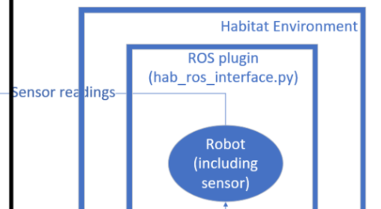
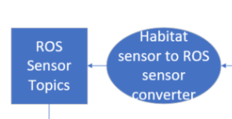

# Habitat ROS Interface

## Motivation
Real world robots move in a continuous environment. To this end, we aim to build on top of the existing Habitat simulator to create a realistic agent traversing through the highly photorealistic 3D environments with ROS connectivity.

## Goal

Connect Habitat simulator environment with ROS so that traditional ROS packages for SLAM and navigation can be used

## Design

## API

Not applicable

## Dependencies (Tested on Ubuntu 16.04 using ROS kinetic)
ROS Kinetic

habitat-api

habitat-sim

## Testing

Coming soon

### Functional Testing

Coming soon

### Performance Testing

Coming soon

### Scale Testing

Coming soon

## Installation Procedures

1. Clone this repository into your catkin_ws/src folder
2. run cd ~/catkin_ws && catkin_make
3. get ROS' laser scan matcher package by running sudo apt-get install ros-kinetic-laser-scan-matcher (confirm if needed)
4. Clone habitat-api and habitat-sim and follow their installation instructions at https://github.com/facebookresearch/habitat-api. Download any of the datasets provided by Habitat that you would like to use (follow habitat's instructions on how to do that) (add correct tag to use)
5. If you have trouble installing habitat-api or sim, see habitat's issues page first. An error I encountered regularly in the past is the "ModuleNotFoundError: No module named 'habitat_sim._ext'" and my hacky way around it is to copy the _ext folder from the build directory (/habitat-sim/build/lib.linux-x86_64-3.6/habitat_sim) to (/habitat-sim/habitat_sim) (maybe ask Habitat people why after trying again first)
6. Cut and paste the habitat_ros folder in this repo into habitat-api's root directory

The following steps are to make sure you can run Anaconda along side ROS (we need Anaconda because Habitat requires python>=3.6 while ROS requires python2)

7. In your Anaconda environment with python version >=3.6, run pip install rospkg one time so hab_ros_plant.py can be ran from your Python3.6 Anaconda environment
8. If your setup.bash files related to ROS is automatically being sourced by ~/.bashrc, remove that so you won't run into errors such as the following when importing cv2 in a Python3.6 Anaconda environment: "/opt/ros/kinetic/lib/python2.7/dist-packages/cv2.so: undefined symbol: PyCObject_Type". 
9. [optional] Add an alias to the sourcing commands of your ROS setup.bash files and only source ROS related bash files when needed) 

    

### Installation Procedure Justifications
1. NA
2. NA
3. Normally ROS does not come with laser scan matcher package, which is needed for visual odometry (TODO confirm this)
4. You need habitat api and habitat sim installed to run simulator backend
5. NA
6. The habitat_ros folder contains the plugin (python module) to interface with the Habitat backend, and this folder is not needed in your ROS package, so I recommend cutting and pasting instead of copying and pasting. In the future, the habitat_ros folder might be merged with habitat-api's repository so you won't have to do this step
7. This step installs a new rospkg in your anaconda environment since the one you installed with your ROS distribution is done using apt-get which installs to you system's default python2 directory. After this step, you can use rospkg functionalities in your anaconda environment with python>=3.6. In short, this step makes sure ROS works in an Anaconda environment with python>=3.6
8. This step allows you to not add ROS paths by default and only add the paths when you need ROS. For instance, you can run any habitat modules by activing your python3.6 anaconda environment without issue when ROS paths are not added.
9. This step allows you to add ROS required paths more easil when you need to use ROS. 

## Running (section will probably be changed into a colored diagram like gazebo_ros interface)
1. activate your anaconda python>=3.6 and cd into habitat-api's root directory

2. Run python habitat_ros/hab_ros_interface.py to begin node that publishes to habitat sensor readings topic and subscribes to the /cmd_vel topics

    

3. Run roslaunch habitat_interface default.launch to convert convert all habitat sensor messages into ROS msgs (e.g. from numpy image convert to ros image) (here I recommend deactivating anaconda and or switching to a python 2.7 environment, as you won't have to interact with the habitat environment again during simulation). This will ensure all of the sensors are being published on the correct topics. The default.launch folder also prpovides an interface with joystick, rviz, rqt_graph, rqt_tree, and laser scan matcher, image view
    

4. Refer to the published subscribed topics below for details 

### habitat-api/habitat_ros/hab_ros_plant.py

This is a script/node that interfaces with the Habitat simulator backend
subscribed topics: /cmd_vel (TODO change to /habitat/cmd_vel)
published topics: 
        self._pub_rgb = rospy.Publisher("rgb", numpy_msg(Floats), queue_size=1)
        self._pub_depth = rospy.Publisher("depth", numpy_msg(Floats), queue_size=1)
        self._pub_depth_and_pointgoal = rospy.Publisher(
            "depth_and_pointgoal", numpy_msg(Floats), queue_size=1
        )

### Habitat_interface package explained
    
this package provides an interface with the habitat back end to convert numpy sensor readings to ros images. launch files for joy control, mapping, navigation are all included. See them for examples on how to utilize this package.

Examples on how to use mapping and navigation are also included. See default.launch, something_mapping.launch and move_base.launch

For example, run roslaunch habitat_interface default.launch to begin publishing ROS depth readings, joy controlller, rgb readings joy readings, laser scans

And launch nodes to visualize the rgb_camera with image_view.

### Modifying Simulator Configurations

All changes to the simulation side can be done on the habitat-api side (generally through the 1 single habitat plugin you previously placed in the habitat-api repository) 

#### Changing scenes

To change scenes, change the config file fed into the environment initializer in hab_ros_interface.py. See habitat-api for a list of scenes available and how to write the config files

#### Changing robot dynamics

You can modify the update_position and update_attitude methods to change the robot's behaviour at each time step. (e.g. you can specifiy that the robot can only accelerate at 0.1m/s^2)
#### Changing sensor publishing freuqency
change the sensor frequency in the sim_env class in hab_ros_interface.py (consider putting all constants as caps in the beginning of the hab_ros_interface file)

### Future work
attempting to wrap habitat in a catkin work space; however, the main difficulty is that most of habitat's paths used in their scripts use relative paths, but rosrun/roslaunch sets its default path to ~/.ros (confirm this), so to wrap habitat in a catkin_package, we either need to change all paths in the habitat environment to be absolute paths, or need to somehow use ROS' rospack find or ($find some_package in launch file) feature to change paths

improving the multithreading implementation of the plug in to optimize for performance

add a simple script to convert habitat's top down map to ROS compatible map with Rviz so ground truth map exists when doing ROS navigation

add sensors to the robot so we can have multiple views at one time when operating the agent

